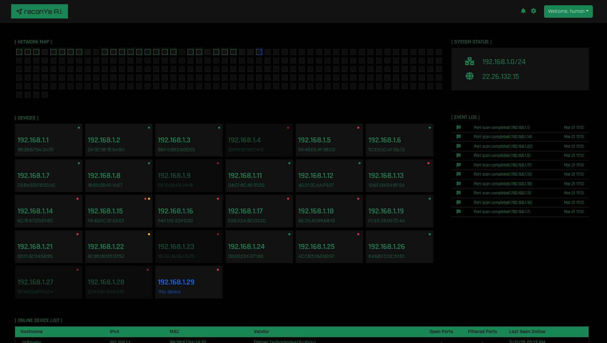

# Reconya

A powerful network reconnaissance and asset discovery tool built with Go and React, designed to help map and monitor network devices with precision and elegance.

<div align="center">
  
</div>

## 🌟 Overview

Reconya helps users discover, identify, and monitor devices on their network with real-time updates and an intuitive interface. Our tool is perfect for network administrators, security professionals, and tech enthusiasts.

### ✨ Key Features

- 🔎 **Advanced Network Scanning** - Comprehensive port scanning and ping sweeping with nmap integration
- 🧩 **Enhanced Device Identification** - MAC addresses, vendor detection, and hostname resolution
- 🕸️ **Network Visualization** - Clear and interactive network topology mapping
- 📊 **Event Monitoring** - Real-time logging and monitoring of network events
- 🖥️ **Modern Dashboard** - Sleek, responsive web interface for all devices
- 🔍 **Deep Device Fingerprinting** - Hardware vendor identification and network interface details

## 🚀 Installation

### 📋 Prerequisites

- 🐳 Docker and Docker Compose (for easy deployment)
- 🔹 Go 1.16+ (for development only)
- 🟢 Node.js 14+ and npm (for development only)

### 🚀 Quick Start (Recommended)

The easiest way to get started is using our setup script:

1. Clone the repository:
   ```bash
   git clone https://github.com/Dyneteq/reconya-ai-go.git
   cd reconya-ai-go
   ```

2. Run the setup script:
   ```bash
   ./setup.sh
   ```
   
   The script will:
   - Check for dependencies
   - Guide you through configuration
   - Set up environment variables
   - Build and start the application

3. Access the application at `http://localhost:3001`

### 🏭 Manual Deployment

If you prefer to set things up manually:

1. Configure environment variables:
   ```bash
   cp .env.example .env
   ```
   
   Edit `.env` with your configuration (network range, credentials, etc.)

2. Build and start the containers:
   ```bash
   docker compose up -d
   ```

3. Access the application at `http://localhost:3001`

### 🛠️ Helper Scripts

We provide several convenient scripts to manage Reconya:

- `setup.sh` - Interactive setup script (recommended for first-time users)
- `start.sh` - Start the application
- `stop.sh` - Stop the application
- `logs.sh` - View application logs
  ```bash
  # View all logs
  ./logs.sh
  
  # Follow logs (live updates)
  ./logs.sh -f
  
  # View only backend or frontend logs
  ./logs.sh backend
  ./logs.sh frontend
  ```

### 💻 Development Setup

For development purposes:

#### 🔧 Backend Setup

1. Set up environment variables:
   ```bash
   cd backend
   cp .env.example .env
   ```
   Edit `.env` with your configuration.

2. Install dependencies:
   ```bash
   cd backend
   go mod download
   ```

3. **Enhanced Network Scanning Setup** (Required for MAC addresses and vendor detection):

   Install nmap:
   ```bash
   # macOS (using Homebrew)
   brew install nmap
   
   # Ubuntu/Debian
   sudo apt-get install nmap
   
   # CentOS/RHEL
   sudo yum install nmap
   ```

   Configure nmap for enhanced device detection:
   ```bash
   # Allow nmap to run with elevated privileges for MAC address detection
   echo "$(whoami) ALL=(ALL) NOPASSWD: $(which nmap)" | sudo tee /etc/sudoers.d/reconya-nmap
   sudo chmod 440 /etc/sudoers.d/reconya-nmap
   
   # Set nmap to run with setuid (alternative approach for better performance)
   sudo chown root:admin $(which nmap)
   sudo chmod u+s $(which nmap)
   ```

   **Note**: These commands enable nmap to capture MAC addresses and vendor information from network devices. Without elevated privileges, you'll only see IP addresses and hostnames.

4. Run the backend:
   ```bash
   go run cmd/main.go
   ```

#### 🎨 Frontend Setup

1. Install dependencies:
   ```bash
   cd frontend
   npm install
   ```

2. Configure environment variables:
   ```bash
   cp .env.example .env
   ```

3. Start the development server:
   ```bash
   npm start
   ```

4. Access the web interface at `http://localhost:3001`

#### ⚙️ Production Customization

- 🔧 **NGINX Configuration**: Edit `frontend/nginx.conf` to customize the web server settings
- 🔒 **SSL/TLS**: For HTTPS, use a reverse proxy like Traefik or modify the NGINX configuration
- 💾 **Persistence**: Database files are stored in the `backend/data` directory. Consider mounting this to a persistent volume
- 🔄 **Auto-updates**: Set up a CI/CD pipeline for automated deployments

## 📝 Usage

1. 🔑 Log in with credentials configured in your `.env` file
2. 🌐 Configure network range to scan in the settings
3. 🔍 Run discovery to find devices on your network
4. 📱 View and manage discovered devices in the dashboard
5. 📊 Monitor network activity through event logs

## 🏗️ Architecture

- 🔙 **Backend**: Go API server with SQLite for storage
- 🖌️ **Frontend**: React/TypeScript web application with responsive Bootstrap UI
- 🔍 **Scanning**: Network operations performed through native Go libraries
- 🔄 **Real-time Updates**: Polling system with configurable intervals
- 🐳 **Deployment**: Docker Compose for easy setup and production use

### 💾 Database

The application uses SQLite for its database, offering several advantages:

#### 🔶 SQLite Benefits
- 📦 Self-contained, no separate database service required
- 🧩 Simple setup with minimal configuration
- 🏠 Perfect for personal or organizational deployments
- 🪶 Lightweight and portable
- 🔒 Data is stored locally in a single file
- 🚫 No need for database administration

## 🔐 Security Notes

- 🔑 Always use strong passwords in production environments
- 🔒 Use an `.env` file for all sensitive configuration
- 🛡️ Never expose the backend API directly to the internet
- 👮 Run with least privilege required for network scanning
- 🔄 Keep dependencies updated to patch security vulnerabilities
- 🧪 Regularly test your deployment for security issues

## 🔧 Troubleshooting

### Common Issues

#### Application Not Accessible
- Make sure ports 3001 and 3008 are not in use by other applications
- Check that Docker containers are running with `docker ps`
- View logs with `./logs.sh` to identify any startup errors
- If the page is blank or shows "Cannot GET /", check the nginx configuration to ensure static files are being served correctly from `/usr/share/nginx/html`

#### CORS Issues
- If you see CORS errors in the browser console, check:
  - The CORS configuration in `backend/middleware/cors.go`
  - The proxy configuration in nginx.conf to ensure proper API routing
  - The axiosConfig.ts to ensure it's using the correct API URL
- For local development, set the Access-Control-Allow-Origin header to "*" 
- For production, set it to your specific domain

#### Authentication Issues
- For development, API endpoints are set to bypass authentication
- For production, uncomment the middleware.AuthMiddleware wrapper in main.go
- If you see "Unauthorized" errors, ensure the JWT token is properly set
- The default login is admin/admin for development environment

#### Permission Issues
- Some network scanning operations require elevated privileges
- Make sure Docker has the necessary network permissions
- If using host networking, run with appropriate privileges

#### Database Issues
- Check that the data directory is writable by the application
- If database errors occur, try removing and recreating the data directory

#### Network Scanning Not Working
- Verify the network range is correctly specified in the .env file
- Ensure the application has access to the target network
- Check that nmap is installed and properly configured
- Check firewall settings that might block ICMP or TCP scanning
- Note: Docker containers may have limited network scanning capabilities due to container isolation

#### Missing MAC Addresses or Vendor Information
- Ensure nmap is installed: `which nmap`
- Verify nmap has elevated privileges (see Enhanced Network Scanning Setup above)
- Check that the setuid bit is set: `ls -la $(which nmap)` (should show 's' in permissions)
- Run a test scan: `nmap -sn -T4 -R -oX - 192.168.1.1` (should show XML output with address elements)
- MAC addresses are only visible for devices on the same network segment
- Some devices may not respond to ping scans or may hide their MAC addresses

### Getting Help
If you're experiencing issues not covered here, please:
1. Check the logs using `./logs.sh`
2. Open an issue in the GitHub repository with detailed information
3. Include log output and system information in your report

## 🤝 Contributing

Contributions are welcome! Please feel free to submit a Pull Request.

1. 🍴 Fork the repository
2. 🌿 Create your feature branch (`git checkout -b feature/amazing-feature`)
3. 💾 Commit your changes (`git commit -m 'Add some amazing feature'`)
4. 🚀 Push to the branch (`git push origin feature/amazing-feature`)
5. 🔍 Open a Pull Request with a detailed description

## 📄 License

This project is licensed under the Creative Commons Attribution-NonCommercial 4.0 International License - see the [LICENSE](LICENSE) file for details. Commercial use requires explicit permission from the author.

## ✨ Features Added in Latest Update

- [Nmap](https://nmap.org/) for inspiration and scanning techniques
- [React](https://reactjs.org/) for the frontend framework
- [Go](https://golang.org/) for the backend language
